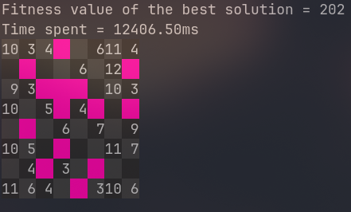

# Solving kuromasu using genetic and swarm algorithms

## What is Kuromasu?

Kuromasu is a logic puzzle game. The objective is to find the location of all the black squares in the grid. The numbers on the borders of the grid indicate how many black squares are in the corresponding row or column. The black squares cannot be adjacent to each other, not even diagonally.

## How to run the program?

You can run the program by executing the following command:

```bash
python kuromasu.py
```

## How does the fitness function work?

The fitness function calculates the score of a solution based on for how many points the black squares are correctly placed. The score is calculated as follows:

For each point with a number we check how many points it can see. If the number of points it can see is equal to the number on the point, we add number to the score. If the number of points it can see is greater than the number on the point, we subtract the difference between the two numbers from the score. If the number of points it can see is less than the number on the point, we subtract the difference between the two numbers from the score.

## Generic algorithm parameters

- Population size: 6000
- Number of generations: 20
- Mutation rate: 1%

The extremaly high population size is due to the fact that the fitness function is very strict and the algorithm needs to explore a lot of solutions to find the correct one. With a smaller population size, the algorithm would not be able to find the correct solution most of the times. The mutation rate is also very low because the algorithm needs to explore the solution space very carefully.

- parent selection: sss selection
- crossover: scattered crossover
- mutation: random mutation

These parameters were chosen by running each possible combination of parameters and choosing the one that gave the best results. There is no real reason for choosing these parameters other than they gave the best results.

## Storing the initial board state

The initial board state is stored in a file called `boards.txt`. The file contains the following information:

- board width
- a space as a separator
- board cells with "^" that the next integer consists of two digits rather than one. ("12" -> [1, 2] but "^12" -> [12])

lines starting with "#" are comments and are ignored by the program.

## Results

### Displaying the best solution

There is a function called `display_board` that displays the best solution found by the algorithm. The function uses the ability to print colored text in the terminal.



Here the walls are represented by magenta color and the empty cells are dark shades of gray.
